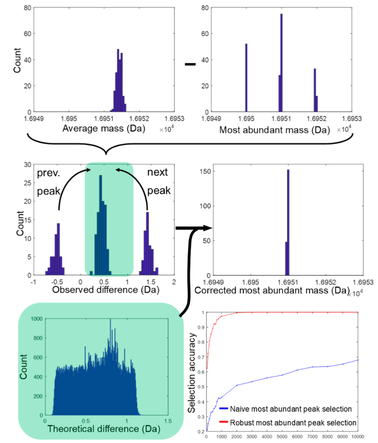

```{r setup, include=FALSE}
knitr::opts_chunk$set(echo = TRUE, warning = FALSE, message = FALSE)
```

In this part of the workshop we will explore the MIND method for predicting monoisotopic mass of a protein based on the mass of the highest peak in the observed isotope distribution. To demonstrate how to use MIND, the dataset from the BRAIN session will be reused.

Reference: 

> MIND: A Double-Linear Model To Accurately Determine Monoisotopic Precursor Mass in High-Resolution Top-Down Proteomics
Frederik Lermyte, Piotr Dittwald, Jürgen Claesen, Geert Baggerman, Frank Sobott, Peter B. O’Connor, Kris Laukens, Jef Hooyberghs, Anna Gambin, and Dirk Valkenborg
Analytical Chemistry 2019 91 (15), 10310-10319
DOI: [10.1021/acs.analchem.9b02682](10.1021/acs.analchem.9b02682)

Nomenclature: the mass of the most-abundant (i.e., highest) peak will be referred to as "most-abundant mass".

## MIND demo

First we load the necessary packages and set seed for reproducibility.

```{r, message = FALSE, results = "hide"}
# Loading packages
library(knitr)
library(kableExtra)
library(tidyverse)
library(phylotools)
library(viridis)
library(BRAIN)

# Seed for MIND demo
set.seed(2024)
```

The chunk below reads in the human proteome dataset and draw a random sample of 1000 protein sequences.

```{r}
Human_proteome <- phylotools::read.fasta("uniprotkb_Human_AND_model_organism_9606_2023_12_01.fasta")
Human_proteome <- Human_proteome$seq.text
# Find indices of elements containing the letter 'U'
indices_to_remove <- grep("U", Human_proteome)

# Remove elements containing 'U'
Human_proteome <- Human_proteome[-indices_to_remove]

protein_sequence_length <- str_length(Human_proteome)

# MIND has been trained on proteins with the highest peak within ~8 000 - 60 000 Da. But we don't have yet any mass information, just amino acid sequence, so below is a heuristic on the sequence length.

Human_proteome_subset <- Human_proteome[protein_sequence_length >= 70 & protein_sequence_length < 500]

# We will analyse ~ 1000 proteins
Human_proteome_sampled <- sample(Human_proteome_subset, size = 1000, replace = FALSE)
```

We wrote a function to obtain protein atomic compositions that are needed for calculating peak masses and intensities with BRAIN.

```{r}
get_atomic_compositions <- function(molecule_sequences, nr_peaks){
  
  DF <- data.frame(Molecule = molecule_sequences)
  DF["AAComp"] <- NA
  DF["Monoisotopic Mass"] <- NA
  DF["Average Mass"] <- NA
  DF["Carbons"] <- NA
  DF["Hydrogens"] <- NA
  DF["Oxygens"] <- NA
  DF["Nitrogens"] <- NA
  DF["Sulphurs"] <- NA
  
  for (i in 1:nr_peaks){
    DF[paste0("BRAINMassPeak", i)] <- NA
    DF[paste0("BRAINRelativeIsotopePeak", i, "Intensity")] <- NA
  }
  
  for(index in 1:nrow(DF)){
    # Extract information from dataframe required
    Molecule <- DF[[index, "Molecule"]]
    # Firstly, we calculate the atomic composition of a peptide sequence and store the results into our dataframe
    AAComp <- getAtomsFromSeq(Molecule)
    DF[index, "Carbons"] <- AAComp[["C"]]
    DF[index, "Hydrogens"] <- AAComp[["H"]]
    DF[index, "Oxygens"] <- AAComp[["O"]]
    DF[index, "Nitrogens"] <- AAComp[["N"]]
    DF[index, "Sulphurs"] <- AAComp[["S"]]
    DF[index, "AAComp"] <- paste0("C", AAComp[["C"]], "H", AAComp[["H"]], "O", AAComp[["O"]], "N", AAComp[["N"]], "S", AAComp[["S"]])
    # Using the amino composition, we can calculate the monoisotopic and average mass
    DF[index, "Monoisotopic Mass"] <- calculateMonoisotopicMass(AAComp)
    DF[index, "Average Mass"] <- calculateAverageMass(AAComp)
    # Lastly, we will calculate the probabilities of aggregated isotopic variants
    BRAINResults <- useBRAIN(aC = AAComp, stopOption="nrPeaks", nrPeaks = nr_peaks)
    
    for (j in 1:nr_peaks){
      DF[index, paste0("BRAINMassPeak", j)] <- BRAINResults[["masses"]][j]
      DF[index, paste0("BRAINRelativeIsotopePeak", j, "Intensity")] <- BRAINResults[["isoDistr"]][j]
    }
  }
  return(DF)
}
```

We then apply the function to the sampled proteins. Since some of the proteins have large molecular weight, and therefore, many isotopes, we request 50 peaks in the output isotope distributions. Note: computations will take a couple of seconds.

```{r}
Human_proteome_DF <- get_atomic_compositions(molecule_sequences = Human_proteome_sampled, nr_peaks = 50)
```

For each protein, we need to determine its most-abundant mass.

```{r}
mass_col_index <- str_detect(colnames(Human_proteome_DF), "BRAINMass")
intensity_col_index <- str_detect(colnames(Human_proteome_DF), "BRAINRelativeIsotope")

# mab_mass = most-abundant mass
mab_mass <- numeric(nrow(Human_proteome_DF))

for (i in 1:length(mab_mass)) {
  x <- Human_proteome_DF[i,]
  max_intensity <- max(x[intensity_col_index])
  max_intensity_ind <- min(which(x[intensity_col_index] == max_intensity))
  mab_mass[i] <- as.numeric(x[which(mass_col_index)][max_intensity_ind])
}
```

Additionally, proteins with the most-abundant mass falling outside the mass range used for training MIND are filtered out.

```{r}
MIND_mass_range_index <- mab_mass >= 8005.1802 & mab_mass <= 60036.47
mab_mass <- mab_mass[mab_mass >= 8005.1802 & mab_mass <= 60036.47]
Human_proteome_DF <- Human_proteome_DF[MIND_mass_range_index,]
```

A quick look on the distribution of the most-abundant masses of the sampled proteins. 
```{r, fig.align='center'}
hist(mab_mass, main = "", xlab = "most-abundant mass (Da)")
```

We see that the distribution is largely uniform, meaning that we will be able to test MIND on its entire domain. MIND has been implemented as an online [Shiny app](https://valkenborg-lab.shinyapps.io/mind/.) that can be used without local R installation. 

Let's now save the mass values into a csv file. **CAUTION**: there should be only one column, without a header! Otherwise an error will be returned by the Shiny app. Moreover, the column should store numeric values within the MIND mass domain, i.e., **[8005.18, 60036.47] Da**.

```{r}
write.table(mab_mass, "mab_mass.csv", row.names = FALSE, col.names = FALSE)
```

## MIND shiny app web tool

The time has come to present the recipe for generating monoisotopic mass predictions with MIND.

1. Open a web browser and go to https://valkenborg-lab.shinyapps.io/mind/.
2. Select the "Multiple masses" button.
3. Click on "Browse" and upload the csv file with input masses. 
4. We're all set to execute MIND by hitting the "Calculate" button.
5. Press "Download Table" and save somewhere on your machine the MIND output CSV file with monoisotopic mass predictions and off-by-one probabilities.

Let's read in the output CSV file.

```{r}
MIND_output <- read.csv("Monoisotopic_Mass.csv")
colnames(MIND_output) <- c("mab_mass", "monoisotopic_mass_MIND", "probability_minus1Da", "probability_0Da", "probability_plus1Da")
head(MIND_output)
```

The three probability columns above correspond to the integer part of model 1 residuals, explained in detail in the MIND article and in the theoretical introduction to MIND given earlier during the winter school. 

Below is the visualistion of the **prediction error**, defined as the **difference between MIND-predicted and BRAIN-calculated** monoisotpic mass value, against the most-abundant mass. 
```{r, fig.align='center', fig.height=5}

MIND_minus_BRAIN_da <- MIND_output$monoisotopic_mass_MIND - Human_proteome_DF$`Monoisotopic Mass`

MIND_minus_BRAIN_ppm <- MIND_minus_BRAIN_da/Human_proteome_DF$`Monoisotopic Mass` * 10^6

plot(MIND_minus_BRAIN_da ~ mab_mass, pch = 16,
     xlab = "most-abundant mass (Da)", 
     ylab = "MIND - BRAIN monoisotopic mass (Da)")
```

We've just seen that the prediction errors form approximately horizontal lines, so we can categorise these errors and summarise their proportions.

```{r}
# compute off-by-one error proportion table
off_by_one_labels <- c("<=-2 Da", "(-2 Da, -1 Da)", "-1 Da", "(-1 Da, 0 Da)", "0 Da", "(0 Da, +1 Da)", "+1 Da", "(+1 Da, +2 Da)",">= +2 Da")

off_by_one_labels <- factor(x = off_by_one_labels, levels = off_by_one_labels, ordered = TRUE)

off_by_one_index <- findInterval(MIND_minus_BRAIN_da, vec = c(-2.2, -1.8, -1.2, -0.8, -0.2, 0.2, 0.8, 1.2, 1.8, 2.2))

MIND_minus_BRAIN_da_label <- off_by_one_labels[off_by_one_index]

tab_counts <- table(MIND_minus_BRAIN_da_label)

tab_percentage <- 100*tab_counts/sum(tab_counts)

tmp <- data.frame(Category = names(tab_percentage), Percentage = as.numeric(tab_percentage))
           
tmp %>%                             
  filter(Percentage != 0) %>% 
  kable(digits = 4) %>% 
  kable_styling(full_width = F)
```

The results presented in the table are in line with outcomes included in the paper: in around 60% of the sampled proteins, MIND predictions end up with the "0 Da" error label. This label implies a negligible prediction error, as confirmed in two close-up graphs below (only proteins with the "0 Da" label are shown; ppm scale).

```{r, fig.align = "center", results='hold'}
par(mfrow=c(1,2))
  hist(MIND_minus_BRAIN_ppm[MIND_minus_BRAIN_da_label == "0 Da"], breaks = 50, xlab = "monoisotopic mass error (ppm)", main = "")
  boxplot(MIND_minus_BRAIN_ppm[MIND_minus_BRAIN_da_label == "0 Da"], ylab = "monoisotopic mass error (ppm)")  
par(mfrow = c(1,1))
```

We need to clean up the global environment before proceeding to the next section.

```{r}
to_keep <- c("Human_proteome_DF", "mass_col_index", "intensity_col_index", "mab_mass")
rm(list = setdiff(ls(), to_keep))
```

## Extra: most-abundant peak selection

A mistake in choosing the highest peak leads to an invalid monoisotopic mass prediction with MIND. This problem is frequently seen when analysing broad isotope distribution of large molecules. In such cases, several peaks have theoretical intensities only a few percent below that of the most-abundant peak, which increases the chance of selecting an incorrect peak. Poor ion statistics also contributes to this kind of error. 

For these reasons, Lermyte et al. have presented a way to diminish this issue in the *Further Refinement: Correction for Poor Ion Statistics* section of the MIND article. To illustrate how the refinement works, we will use one protein with molecular weight around 20 kDa.

```{r}
one_protein_index <- str_detect(Human_proteome_DF$Molecule, "MAKFVIRPATAADCSDILRLIKELAKYEYMEEQVILTEKDLLED")

one_protein <- Human_proteome_DF[one_protein_index, ]

true_mam <- mab_mass[one_protein_index]

true_ma_peak_number <- which(Human_proteome_DF[one_protein_index, mass_col_index] == true_mam)
```

Some information about the selected protein:

```{r}
one_protein %>% select(Molecule:Sulphurs)

# true peak number and mass of the most-abundant isotope variant
c(true_ma_peak_number, true_mam)
```

So the `r true_ma_peak_number`th peak is the most-abundant isotopic variant at `r round(true_mam)` Da.

Next, to mimic the variability on peak intensities that is caused by ion sampling occurring inside the mass spectrometer, we will exploit a multinomial distribution in which the probabilities are set to BRAIN-calculated intensities. Total ion count is set to a relatively small value of 10 000. We then draw 100 samples from the multinomial distribution.

```{r}
multinom_samples <- rmultinom(n = 100, size = 10000, prob = one_protein[intensity_col_index])
one_protein_masses <- as.numeric(one_protein[, mass_col_index])
```

Below the most-abundant peak is designated for all samples by simply looking at the peak intensities.

```{r}
samples_mam_peak_number <- apply(multinom_samples, 2, function(x) min(which(x == max(x))))
```

Let's look at the visualisation of three random samples.

```{r, fig.align = "center", fig.height = 4, out.width = "100%", results="hold"}
par(mfrow = c(1,3))
iter <- sort(sample(1:100, 3))

for (i in iter){
  plot(multinom_samples[,i] ~ I(as.numeric(one_protein[mass_col_index])), type = 'h', xlab = "Mass (Da)", ylab = "Intensity", main = paste0("sample ", i, "\n highest peak number = ", samples_mam_peak_number[i]))

  points(x = c(true_mam, one_protein_masses[samples_mam_peak_number[i]]), 
         y = c(multinom_samples[c(true_ma_peak_number, samples_mam_peak_number[i]), i]), 
         col = c("blue", "darkorchid3"), cex = 1.5)
  
  legend("topright", legend = c("True MAB mass", "MAB mass from data"), col = c("blue", "darkorchid3"), bty = 'n', pch=1, cex = 0.8)
}
par(mfrow = c(1,1))
```

Indeed, we can clearly observe variation in the peak heights and the resulting errors in most-abundant peak selection.

```{r}
mab_peak_number_error <- unname(samples_mam_peak_number) - true_ma_peak_number

(tab_error1 <- table(mab_peak_number_error))
```

In a large number of cases, the index of the highest peak in the sampled peak patterns is larger by plus one compared to the true index number (`r true_ma_peak_number`). The opposite case, i.e. the selected peak index being lower by one, is much less frequent. This can be explained by looking at the probabilities of the peaks number 12, 13, and 14: 9.78\%, 10.38\%, 10.28\%, respectively. So the probability value of peak 14 is closer to the most-abundant one than peak 13.

The workflow to pinpoint the "true" most-abundant mass involves iteratively calculating the difference between the intensity-weighted average mass and the highest peak mass. Across around 78 000 protein sequences found in the MIND training dataset, such a difference consistently range from 0.1 to 1.2 Da. 

Let's check what is the range of the difference among the **initially sampled 1000 proteins**.      

```{r, results='hold'}
  q_tmp <- Human_proteome_DF[, intensity_col_index]
  m_tmp <- Human_proteome_DF[, mass_col_index]
  
  # calculate average mass minus most abundant
  row_q_sum <- apply(q_tmp, 1, sum, na.rm = TRUE)
  q_tmp <- apply(q_tmp, 2, function(x) x / row_q_sum)
  wgt_avg_mass <- apply(q_tmp * m_tmp, 1 , sum)
  the_difference <- wgt_avg_mass - mab_mass
  hist(the_difference, main = " ", xlab = "Intensity-weighted average mass - most abundant mass (Da)")
```

```{r, echo = FALSE}
rm(list = c("q_tmp", "m_tmp", "wgt_avg_mass", "mab_mass", "the_difference"))
```

The difference behave similarly as in the original publication, so we will be using theerein proposed thresholds. 

Therefore, when the value of the difference exceeds 1.2 Da, it means incorrect selection of the signal to the left of the authentic most-abundant isotope peak. In such cases, the subsequent peak in the series should be employed as input for the MIND algorithm. 

Conversely, a value of the difference below 0 indicates that the chosen peak is too heavy, necessitating the selection of the preceding peak in the isotope distribution. 
This procedure (also visualised below) is repeated until the difference falls again inside the [0.1, 1.2] Da interval. 

```{r, echo=FALSE, fig.align="center", fig.height = 5, out.width = "880%"}

```

We will be applying the heuristic to the simulated isotope distributions of the selected protein.

```{r}
# compute intensity-weighted average mass (without using atomic composition)
multinom_samples_t <- t(multinom_samples)
q_tmp <- multinom_samples_t
m_tmp <- as.numeric(one_protein[, mass_col_index])
row_q_sum <- apply(q_tmp, 1, sum, na.rm = TRUE) # the row sums are 10 000, but this way we avoid hardcoding
q_tmp <- apply(q_tmp, 2, function(x) x / row_q_sum)
wgt_avg_mass <- apply(q_tmp , 1 , function(x) sum(x * m_tmp))

mam_peak_initial <- m_tmp[samples_mam_peak_number]
mam_peak_corrected <- numeric(length(mam_peak_initial))
the_difference <- as.numeric(wgt_avg_mass - mam_peak_initial)

threshold <- c(0.1, 1.2)

for (i in 1:length(mam_peak_initial)) {
  best_mode_mass <- mam_peak_initial[i]
  delta <- the_difference[i]
  peak_ind <- samples_mam_peak_number[i]
  n_iter <- 0
  
  direction <-
    ifelse(
      between(delta, threshold[1], threshold[2]),
      "middle",
      ifelse(delta > threshold[2], "upper", "lower")
    )
  
  while (delta < threshold[1] | delta > threshold[2]) {
    peak_ind_prev <- peak_ind
    
    if ((delta > threshold[2])  & direction == "upper") {
      peak_ind <- peak_ind + 1
    } else if ((delta < threshold[1]) & direction == "lower") {
      peak_ind <- peak_ind - 1
    }
    
    n_iter <- n_iter + 1
    
    if (peak_ind == peak_ind_prev) {
      mam_peak_corrected[i] <- m_tmp[peak_ind]
      break()
      
    } else {
      best_mode_mass <- m_tmp[peak_ind]
      delta <- wgt_avg_mass[i] - best_mode_mass
    }
  }
  mam_peak_corrected[i] <- m_tmp[peak_ind]
}
```

```{r}
samples_mam_peak_number_corrected <- unlist(lapply(mam_peak_corrected, function(x) which(x == m_tmp)))

mab_peak_number_error2 <- samples_mam_peak_number_corrected - true_ma_peak_number

(tab_error2 <- table(mab_peak_number_error2))
```

This means that  all the initially incorrectly chosen peaks (`r sum(tab_error1[names(tab_error1) != "0"])` in total) have been fixed with this procedure! 

Finally, let's revisit the three earlier visualised simulated isotope distributions.

```{r, results = "hold", fig.align = "center", fig.height = 4, out.width = "100%", results="hold"}
par(mfrow = c(1,3))
for (i in iter){
  
  plot(multinom_samples[,i] ~ I(as.numeric(one_protein[mass_col_index])), type = 'h', xlab = "Mass (Da)", ylab = "Intensity", main = paste0("sample ", i, "\n highest peak number = ", samples_mam_peak_number_corrected[i]))

  points(x = c(true_mam, one_protein_masses[samples_mam_peak_number_corrected[i]]), 
         y = c(multinom_samples[c(true_ma_peak_number, samples_mam_peak_number_corrected[i]), i]), 
         col = c("blue", "darkorchid3"), cex = 1.5)
  
  legend("topright", legend = c("True MAB mass", "MAB from data"), col = c("blue", "darkorchid3"), bty = 'n', pch = 1, cex = 0.8)
}
par(mfrow = c(1,1))
```